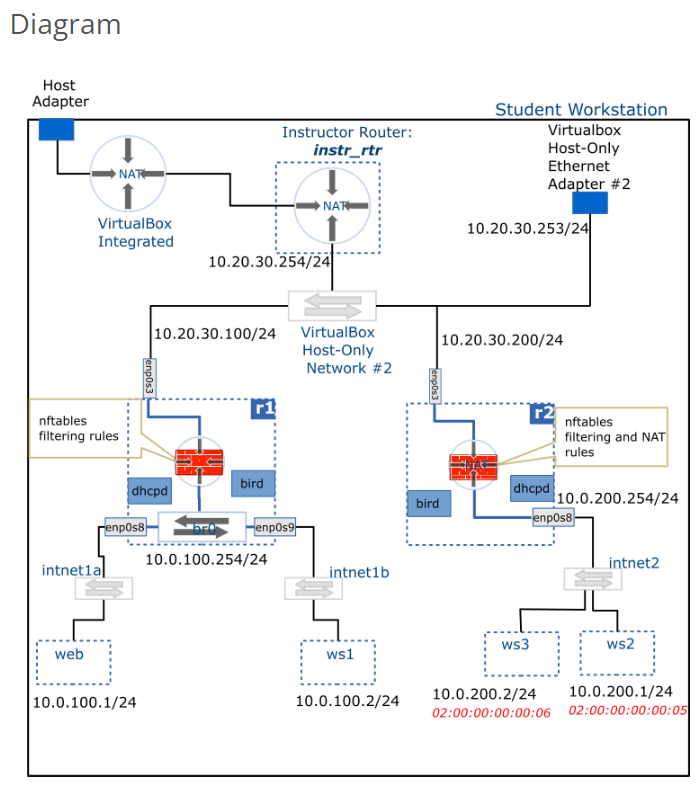

# Network Configuration Exercise 

---
### Other Commands 

```Shell 
# Use PowerShell for VMs (Easier to Copy and Paste Script or Commands)
`ssh VM_NAME` 

# In order to ping web from r1, 
# Disable Firewall 
`sudo disable nftables.service` 
# Stop Firewall 
`sudo stop nftables.service`

# Other Notes: 
# You should be able to ping to web and ws1 from ws2 and ws3. 
```


In this activity, you will configure two new networks as follows: 

---

## First Activity 

* In Virtualbox, create an *internal network* named **grp5_128** to which you will attach the **r1** VM as well as two newly cloned VM's named **test1** and **test2** 

* The network should be configured with the following IP range: **10.0.46.128/26**

* Your *DHCP configuration* in **r1** should be updated to also serve requests from this new network. <br/>
The configuration should contain a fixed address assignment for either **test1** or **test2**. 

* Your *dynamic routing configuration (bird)* in **r1** should advertise this new network so that it is discoverable and accessible from anywhere in the surrounding topology. <br/>
That is, you should be able to send traffic from nodes in the new network to nodes in other networks in the project topology. 

---

### Steps to Solve the 1st Activity 

#### Step 1. r1 Settings -> Enable a new Network Adapter 
1. Right-click on **r1** -> select **Settings** 
2. In r1 Settings -> click on **Network** tab 
3. Select an unused **Adapter** 
4. Select **Enable Network Adapter** 
* Attached to: **Internal Network** 
* Name: **grp5_128**
* Adapter Type: **Paravirtualized Network (virtio-net)** 
* Promiscuous Mode: **Allow All**
* MAC Address: 
5. Press "OK" 

#### Step 2. New VMs - test1 & test2 (Cloned from centos_8_base)
1. Right-click on **centos_8_base** -> click on **Clone** 
2. Name: **test1** or **test2** 
3. MAC Address Policy: **Generate new MAC addresses for all network adaptors** 
4. Click **Next** 
5. Select **Link Clone** 
6. Select **Clone** 

#### Step 3. Set Up Network in VMs 
1. Right-click on **test1** or **test2** -> select **Settings** 
2. Select **Enable Network Adapter** 
* Attached to: **Internal Network** 
* Name: **grp5_128**
* MAC Address: (r1) **02.00.00.00.00.10** (r2) **02.00.00.00.00.11**
3. Press "OK" 

### From now on, everything will be done in r1. 

#### Step 4. r1 
1. Start **r1** 
2. Type `nmtui` -> select **Edit a connection** -> edit **Wired Connection** -> follow below points -> click **Save** 
* Change **Profile name** 
* IPv4 CONFIGURATION: **Manual**
* New IP Address: **10.0.46.190/26** (Recommended to use HostMax) <br/>
<br/>
Networking Tool: https://jodies.de/ipcalc <br/>
For example, **10.0.46.128/26** has a range of IP addresses from (Network) 10.0.46.128 to (Broadcast) 10.0.46.191 <br/>
and a range of usable IP addresses from (HostMin) 10.0.46.129 to (HostMax) 10.0.46.190. 
3. Select **Activate a connection** -> **Deactivate** and **Activate** -> click **Back** 

4. `ip a` to check IP addresses 

#### Step 5. dhcpd.conf - New Subnet with Netmask 
1. `sudo vim /etc/dhcp/dhcpd.conf` 
2. Create a new Subnet with Netmask 

```Shell 
# DHCP Server Configuration file.
#   see /usr/share/doc/dhcp-server/dhcpd.conf.example
#   see dhcpd.conf(5) man page
# Global options

option domain-name "2620.acit";
option domain-name-servers 8.8.8.8,10.20.30.254;

subnet 10.0.100.0 netmask 255.255.255.0 {
        option routers 10.0.100.254;
        range 10.0.100.100 10.0.100.200;
}

host web {
        hardware ethernet 02:00:00:00:00:03;
        fixed-address 10.0.100.1;
}

host ws1 {
        hardware ethernet 02:00:00:00:00:04;
        fixed-address 10.0.100.2;
}

# New Subnet with Netmask Below: 

# subnet GIVEN_IP netmask NETMASK_IP (Tool: https://jodies.de/ipcalc)
subnet 10.0.46.128 netmask 255.255.255.192 {
        # option routers HOSTMAX_IP (IP Address used by r1)
        option routers 10.0.46.190;
        # Range should be within Usable IP range, and Fixed Addresses canNOT be included in this range. 
        range 10.0.46.129 10.0.46.150;
}

host test1 {
    # MAC Address 
    hardware ethernet 02.00.00.00.00.10; 
    # Fixed Address NOT within range assigned in subnet with netmask 
    fixed-address 10.0.46.151;
}

host test2 {
    # MAC Address 
    hardware ethernet 02.00.00.00.00.11; 
    # Fixed Address NOT within range assigned in subnet with netmask 
    fixed-address 10.0.46.152;
}
```

3. `sudo dhcpd -t` to check configuration syntax 
* Correct: "Source compiled to use binary-leases" 
4. `sudo systemctl restart dhcpd` 

#### Step 6. bird.conf - New Interface 
1. `sudo vim /etc/bird.conf` 
2. Add a new interface **enp0s10**

```Shell 
log syslog all;

router id 10.20.30.100;

protocol device {

}

protocol kernel {
        ipv4 {
                export all;
        };
}

# Protocol ospf allows routers to communicate 
protocol ospf {
        area 0 {
                interface "enp0s3" {
                };
                # New Interface 
                interface "enp0s10" {
                }; 
                interface "br0" {
                        stub;
                };
        };
}
```
3. `sudo bird -p` to check configuration syntax 
* Correct: Nothing will show 
4. `sudo systemctl restart bird` 

#### Step 7. Verify IP Address 
* In **test1** and **test2**, type `ip a` to verify if IP address shown is the *fixed address* assigned in **dhcpd.conf**. 
* In **test1** or **test2**, ping web by using `ping 10.0.100.1` 

---

## Second Activity 

* Using the **centos_8_base** image, clone a new VM and name it **grp1_rtr**. <br/>
This VM should be connected to the same *host-only network* as **r1** and **r2**, and to a new *internal network* named **grp1_128**. 

* The **grp1_128** should be configured with the following IP range: **10.0.45.128/26** 

* Make two more VM clones named **test3** and **test4** and connect them to the **grp1_128** network. 

* Configure **grp1_rtr** with appropriate IP addresses 

* Create a *DHCP configuration* in **grp1_rtr** to serve requests from the **grp1_128** network then run the service. <br/>
This configuration should contain *fixed address* assignments for both **test3** and **test4**. 

* Create a *dynamic routing configuration* in **grp1_rtr** such that the new **grp1_128** network is discoverable and accessible from the rest of your project topology. 

--- 

### Steps to Solve the 2nd Activity 

#### Step 1a. New Router (Clone from centos_8_base)
1. Right-click on **centos_8_base** -> click on **Clone** 
2. Name: **grp1_rtr**
3. MAC Address Policy: **Generate new MAC addresses for all network adaptors** 
4. Click **Next** 
5. Select **Link Clone** 
6. Select **Clone** 

#### Step 1b. Set Up Network in New Router (Host-Only Ethernet Adapter & Internal Network)

##### Host-Only Adapter 
1. Select **Enable Network Adapter** 
* Attached to: **Host only Adapter** 
* Name: **VirtualBox-Host-Only Ethernet Adapter #2**
* Adapter Type: **Paravirtualized Network (virtio-net)** 
* Promiscuous Mode: **Allow All**
* MAC Address: 
2. Press "OK" 

##### Internal Network 
1. Select **Enable Network Adapter** 
* Attached to: **Internal Network** 
* Name: **grp1_128**
* Adapter Type: **Paravirtualized Network (virtio-net)** 
* Promiscuous Mode: **Allow All**
* MAC Address: 
2. Press "OK" 

#### Step 2a. New VMs - test3 & test4 (Cloned from centos_8_base)
1. Right-click on **centos_8_base** -> click on **Clone** 
2. Name: **test3** or **test4** 
3. MAC Address Policy: **Generate new MAC addresses for all network adaptors** 
4. Click **Next** 
5. Select **Link Clone** 
6. Select **Clone**

#### Step 2b. Set Up Network in test3 & test4 (NOT Routers)
Note: Do NOT Change Advanced Settings - Remain DENY for Promiscous Mode. 
1. Select **Enable Network Adapter** 
* Attached to: **Internal Network** 
* Name: **grp1_128**
* Adapter Type: **Paravirtualized Network (virtio-net)** 
* MAC Address: 
2. Press "OK" 

#### Step 3. Router grp1_rtr 
1. `nmtui` 
2. Edit **System enp0s3** to an IP address that is NOT being used (Ex: 10.20.30.10/24) <br/>
3. Edit **Wire Connection** to an IP address within the usable range of the given IP address (HostMax recommended: 10.0.45.190)

### Windows PowerShell 
* `ssh admin@10.20.30.10`

#### Step 4. dhcpd.conf - New Subnet with Netmask 
1. `sudo vim /etc/dhcp/dhcpd.conf` 
2. Create a new Subnet with Netmask 

```Shell 
# DHCP Server Configuration file.
#   see /usr/share/doc/dhcp-server/dhcpd.conf.example
#   see dhcpd.conf(5) man page
# Global options

option domain-name "2620.acit";
option domain-name-servers 8.8.8.8,10.20.30.254;

subnet 10.0.100.0 netmask 255.255.255.0 {
        option routers 10.0.100.254;
        range 10.0.100.100 10.0.100.200;
}

host web {
        hardware ethernet 02:00:00:00:00:03;
        fixed-address 10.0.100.1;
}

host ws1 {
        hardware ethernet 02:00:00:00:00:04;
        fixed-address 10.0.100.2;
}

# New Subnet with Netmask Below: 

# subnet GIVEN_IP netmask NETMASK_IP (Tool: https://jodies.de/ipcalc)
subnet 10.0.45.128 netmask 255.255.255.192 {
        # option routers HOSTMAX_IP (IP Address used by grp1_rtr)
        option routers 10.0.45.190;
        # Range should be within Usable IP range, and Fixed Addresses canNOT be included in this range. 
        range 10.0.45.129 10.0.45.150;
}

host test3 {
    # MAC Address 
    hardware ethernet 02.00.00.00.00.12; 
    # Fixed Address NOT within range assigned in subnet with netmask 
    fixed-address 10.0.46.151;
}

host test4 {
    # MAC Address 
    hardware ethernet 02.00.00.00.00.13; 
    # Fixed Address NOT within range assigned in subnet with netmask 
    fixed-address 10.0.46.152;
}
```

3. `sudo dhcpd -t` to check configuration syntax 
* Correct: "Source compiled to use binary-leases" 
4. `sudo systemctl enable dhcpd` -> `sudo systemctl start dhcpd` 

* Now **test3** and **test4** should have proper IP address
* Start **test3** and **test4** in **Oracle VM** 

#### Step 5. Router - sysctl.conf 
1. `sudo vim /etc/sysctl.conf` 
2. Add the following to the end of the file: 
```Shell
net.ipv4.ip_forward = 1 
```
3. Run `sudo sysctl --system` to enable IP forwarding 

#### Step 6. bird.conf - New Interface   
Secure copy of bird.conf from r1 
* `sudo scp admin@10.20.30.100:/etc/bird.conf /etc/bird.conf`<br/>
-> "yes" -> enter password 

1. `sudo vim /etc/bird.conf` 
2. Change **router id** to **enp0s3 Interface IP**

```Shell 
log syslog all;

router id 10.20.30.10; # Use enp0s3 Interface IP as the router id 

protocol device {

}

protocol kernel {
        ipv4 {
                export all;
        };
}

# Protocol ospf allows routers to communicate 
protocol ospf {
        area 0 {
                interface "enp0s3" {
                };
                # Interface enp0s8 NOT participate in communication with other routers, indicates by "stub" 
                interface "enp0s8" {
                        stub;
                };
        };
}
```
3. `sudo bird -p` to check configuration syntax 
* Correct: Nothing will show 
4. `sudo systemctl enable bird` -> `sudo systemctl start bird`

---

Other Helpful Commands: 
* `ip a` checks IP Addresses 
* `ip route` checks Routing Table, may tkae a couple times to have a complete list 
* `ping 10.0.100.1` ping web 
* `ping 10.0.100.2` ping ws1 

* `ping 10.0.200.1` should NOT be able to ping ws2, due to it is a private network 
* `ssh admin@10.20.30.200 -p 52022` admin log in with IP address of R2 and Port Number will be able to ping ws2 

* Assign `stub` to an interface that does not involve in communication with other routers  
